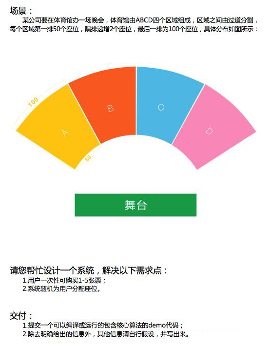

## 选座位



### 预置假设

1. 假设单次买票的票都倾向于坐在一起, 即使坐不到一起, 也希望坐在相互最近的位置, 且不同区域间隔较远, 所以他们倾向于坐在同一个区域
2. 假设单次买多人情况下, 会由第一名"座位位置选择人"来确定座位的基本大致位置, 其他座位在该座位周边坐下
~~3. 假设最后只有N个座位, 但是同组人有N+个时, 该组放弃选位, 交由下一组来选择, 直到座位选完为止~~
3. 假设最后只有N个座位, 但是同组人有N+个时, 该组前N人获得座位

### 操作

1. 询问需要做什么(显示某区域的座位/让用户购票)
2. 如果是显示某区域座位, 直接选择区域, 然后显示该区域的当前座位情况(已售位置为1, 未售为0)
3. 如果是输入组数, 则根据数量来判断一次放多少组进来买票(每组1-5人, 人数随机生成)
4. 随机生成座位(完全随机, 保证每个座位获取到的几率相等), 并输出到日志, 显示给其分配的座位情况
5. 继续询问需要做什么(显示某区域的座位/让用户购票) (loop)
6. 当座位选择完后, 提示票已售完

### 思路

1. 生成座位的二维点阵图
2. 取出所有座位, 生成待售座位数组
3. 设定随机位置与随机人数(1-5名), 并从待售座位数组中取出需要的随机人数的票
4. 输出该票
5. 当待售座位数组为空时, 代表票已售完

### DEMO运行

需确保当前环境有安装[Nodejs](https://nodejs.org/en/download/)

目前我的调试环境是`Nodejs v12.19.1`版本

第一步: 安装依赖

```
yarn // or npm install 
```

第二步: 运行工程

```
yarn start // or npm run start
```
